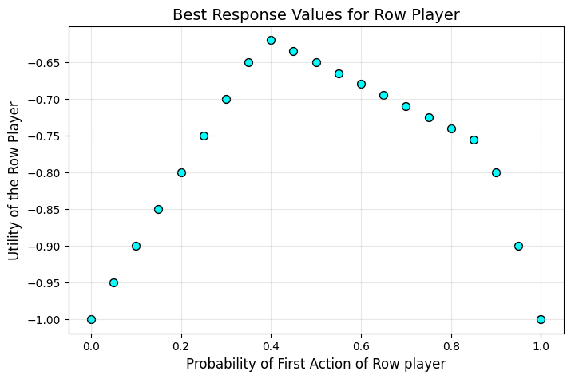

## Maximin to Nash Equilibrium

let $\hat{\pi}_1$, $\hat{\pi}_2$ be the maximin strategies for Player 1 and Player 2 respectively in a two-player zero-sum game. Let $v$ be the game value.

$$\min_{\pi_2 \in \Pi_2} u(\hat{\pi}_1, \pi_2) = \max_{\pi_1 \in \Pi_1} \min_{\pi_2 \in \Pi_2} u(\pi_1, \pi_2) $$

$$\max_{\pi_1 \in \Pi_1} u(\pi_1, \hat{\pi}_1) = \min_{\pi_2 \in \Pi_2} \max_{\pi_1 \in \Pi_1} u(\pi_1, \pi_2) $$

by definition:
$$\min_{\pi_2 \in \Pi_2} u(\hat{\pi}_1, \pi_2) = v$$

this means:
$$u(\hat{\pi}_1, \pi_2) \ge v \quad \forall \pi_2 \in \Pi_2 $$

setting $\pi_2$ to $\hat{\pi}_2$, we have:

$$u(\hat{\pi}_1,\hat{\pi}_2) \ge v$$

by definition:
$$\max_{\pi_1 \in \Pi_1} u(\pi_1, \hat{\pi}_2) = v$$

this means:
$$u(\pi_1, \hat{\pi}_2) \le v \quad \forall \pi_1 \in \Pi_1$$

setting $\pi_1$ to $\hat{\pi}_1$, we have:

$$u(\hat{\pi}_1,\hat{\pi}_2) \le v$$

therefore,

$$u(\hat{\pi}_1,\hat{\pi}_2) = v$$

if player 1 deviate,
$$u(\pi_1, \hat{\pi}_2) \le u(\hat{\pi}_1, \hat{\pi}_2) \quad \forall \pi_1 \in \Pi_1$$

if player 2 deviate:
$$u(\hat{\pi}_1, \pi_2) \ge u(\hat{\pi}_1, \hat{\pi}_2) \quad \forall \pi_2 \in \Pi_2$$

Since neither player can unilaterally improve their outcome, the strategy profile $(\hat{\pi}_1, \hat{\pi}_2)$ is a Nash Equilibrium.

## Nash to Maximin

Player 1 cannot increase $u$ by deviating:$$u(\pi_1, \hat{\pi}_2) \le u(\hat{\pi}_1, \hat{\pi}_2) \quad \forall \pi_1 \in \Pi_1$$

Player 2 cannot decrease $u$ by deviating:$$u(\hat{\pi}_1, \pi_2) \ge u(\hat{\pi}_1, \hat{\pi}_2) \quad \forall \pi_2 \in \Pi_2$$

$$u(\pi_1, \hat{\pi}_2) \le u(\hat{\pi}_1, \hat{\pi}_2) \le u(\hat{\pi}_1, \pi_2) \quad \forall \pi_1 \in \Pi_1, \pi_2 \in \Pi_2$$

Therefore,

$$u(\hat{\pi}_1, \hat{\pi}_2) \le \min_{\pi_2 \in \Pi_2} u(\hat{\pi}_1, \pi_2)$$

since $\hat{\pi}_2$ is a specific strategy in $\Pi_2$, the value $u(\hat{\pi}_1, \hat{\pi}_2)$ cannot be strictly less than the minimum over all $\pi_2$. Thus:

$$u(\hat{\pi}_1, \hat{\pi}_2) = \min_{\pi_2 \in \Pi_2} u(\hat{\pi}_1, \pi_2)$$

Since,

$$u(\pi_1, \hat{\pi}_2) \le u(\hat{\pi}_1, \hat{\pi}_2)$$

Therefore,
$$u(\pi_1, \hat{\pi}_2) \le \min_{\pi_2 \in \Pi_2} u(\hat{\pi}_1, \pi_2)$$

Since, $$\min_{\pi_2 \in \Pi_2} u(\pi_1, \pi_2) \le u(\pi_1, \hat{\pi}_2)$$,

Taking the maximum over $\pi_1$ on the left side:$$\max_{\pi_1 \in \Pi_1} \min_{\pi_2 \in \Pi_2} u(\pi_1, \pi_2) \le \min_{\pi_2 \in \Pi_2} u(\hat{\pi}_1, \pi_2)$$

Since $\hat{\pi}_1$ is just one specific strategy in the maximization set $\Pi_1$, $\hat{\pi}_1$ maximizes the minimum utility:$$\hat{\pi}_1 \in \arg \max_{\pi_1 \in \Pi_1} \min_{\pi_2 \in \Pi_2} u(\pi_1, \pi_2)$$

it is symatrical for $\hat{\pi}_2$.

## Plot

matrix = np.array([[-1, 0, -0.8], [1, -1, -0.5]], dtype=np.float32)

